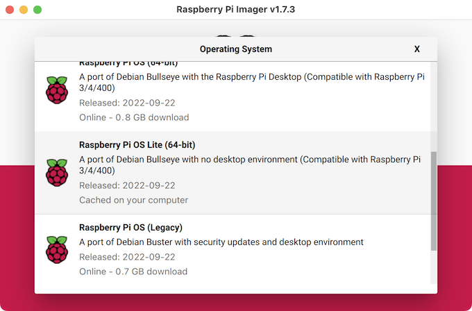

# Installing Solar Protocol

## Hardware

* Solar Charge Controller: We use [EPever Tracer2210AN](https://www.epever.com/product/tracer-an-10-40a-mppt-charge-controller/), but any Epever Tracer-AN Series would work
* Raspberry Pi 3B+ or 4
* 4GB microSD card

### Wiring

This works with a [USB to RS485 converter](https://www.sparkfun.com/products/15938) (ch340T chip model).

* RJ45 blue => b
* RJ45 green => a

## Software

1. Prepare the SD card

Download the official [Raspberry Pi Imager](https://www.raspberrypi.com/software/)

Choose "Raspberry Pi OS (Other)"

Scroll down and choose "Rapsberry Pi OS Lite (64-bit)"

Click the gear icon (and on macOS, if it asks, choose Yes to prefill the wifi password)

- [ ] Set Hostname
- [ ] Enable SSH
- [ ] Set username and password
- [ ] Configure wireless LAN
    - [ ] **Wireless LAN Country**
- [ ] Set locale settings

Click save, then choose storage and pick your microSD card

Click write, put it in the pi, and plug the pi in!

### Install the latest code

First, connect to the pi

    ssh pi@<your-hostname-here>.local

Download the git repository

    sudo apt-get install git --yes
    git clone --branch beta http://www.github.com/alexnathanson/solar-protocol.git
    cd solar-protocol

Install required dependencies - the pi will reboot once

    ./solar-protocol install

### Join the network

* Follow [the raspberry pi security guide](https://www.raspberrypi.com/documentation/computers/configuration.html#securing-your-raspberry-pi)
* Point your router port 80 to raspberry pi ip port 11221
* Point your router port 22 to raspberry pi ip port 22

### Reboot at midnight (TODO: automate)

Open the root crontab

    sudo crontab -e

Add this line to the bottom to restart the server at midnight

    reboot daily `@midnight sudo reboot`

#### Enable network wait (TODO: automate)

This ensures that the necessary network requirements are in place before Solar Protocol runs.

- [ ] Enable "Wait for Network at Boot" option in `raspi-config`.
