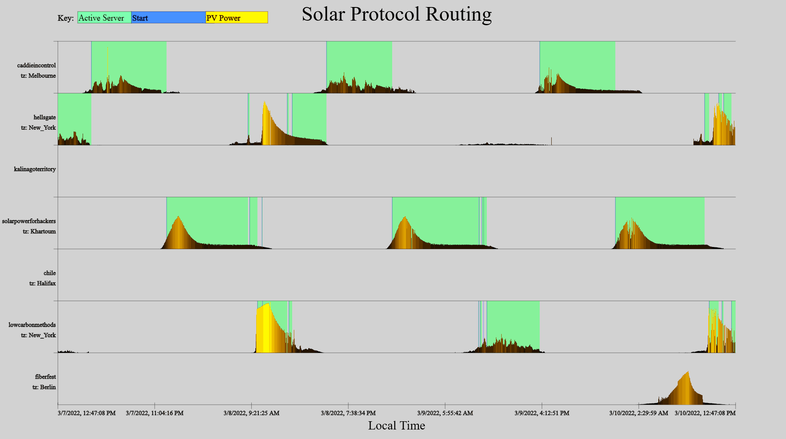
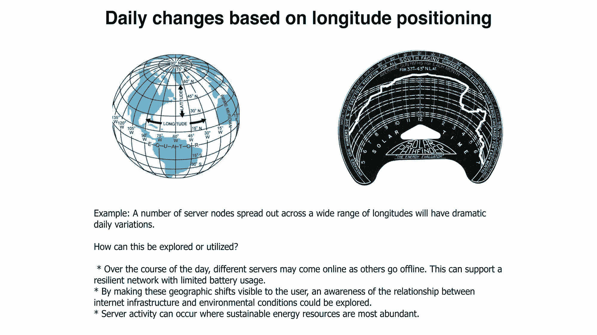
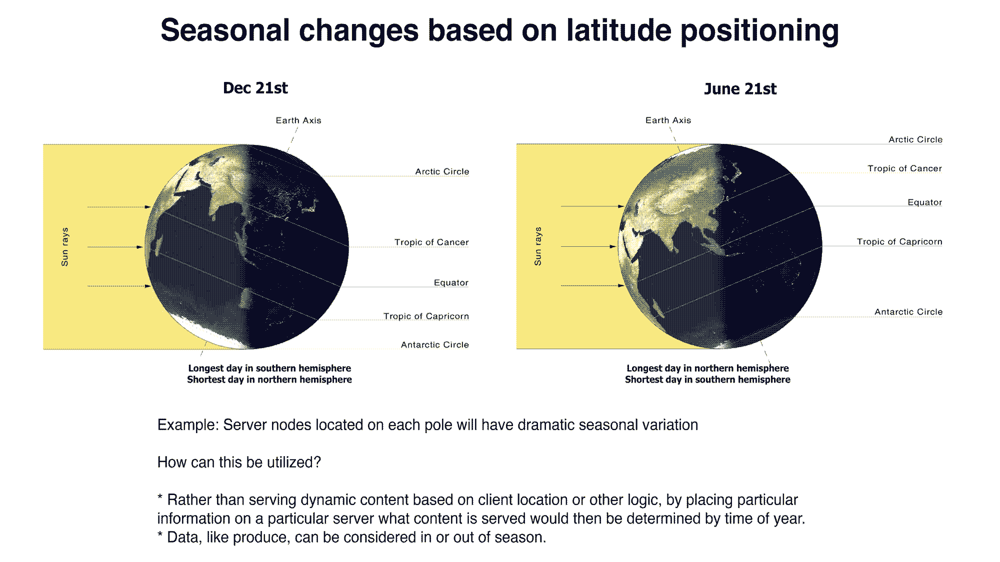

# What kind of projects can run on Solar Protocol?

Solar Protocol can provide solar powered, community-owned server space for web projects and it gives open access to the solar energy data from all the server's in the network via the system's open API.

Projects that utilize and experiment with Solar Protocol energy data (from the API) could be created and hosted anywhere on the web, or they could be hosted on Solar Protocol servers. The API is open and so projects hosted elsewere would require no support from the Solar Protocol team. Projects that are to be hosted on the Solar Protocol platform and servers, require various levels of collaboration. [i think this last bit could be clarified a bit. does the person need to apply to server space etc]

This guide describes some different types of projects that could be developed with Solar Protocol, categorizing them as: external (projects using solar protocol data but are hosted elsewhere), single server (projects are hosted on a single solar server and that may also experiment with that server's local energy data), or network (projects that are hosted on the Solar Protocol software platform, and that therefore get served with it from whereever there is sun in the network).

## External Projects

External projects are purely client side projects that use the publicly available open API (insert link to API tutorial) to get data from Solar Protocol and do something with it. Because these projects can be hosted anywhere and because our API is open, you do not need to coordinate with or get permission from us (though we'd love to learn about them). Client side projects could, however, also be hosted on a single solar server or on the Solar Protocol software platform (see below).

To develop an external project, check out the API tutorial.

## Single Server Projects – projects hosted on one server

A single server project is a project that runs on a specific Solar Protocol server. In addition to the open API, these projects make use of something specific to the server they are running on. There are a number of technical and conceptual reasons a project might need to run on a specific Solar Protocol server. For example, it might require additional types of data that aren't available on the public API or it might be engaging with the specific place, geographic location, materiality, or intermittency of the server itself.

One example of a single server project is the Low Carbon Methods website. Low Carbon Methods is a lab at Trent University and so it was important that the site is hosted at that location, the website is also an exploration of intermittency and uses energy-centered design principles to communicate energetic aspects of the server.

*This video shows the path of the sun over New York City in August.*

## Network Projects – projects hosted across the network

Projects can also be hosted on the Solar Protocol software platform, that is distributed across all the servers in the network. The location where the project is hosted will change throughout the day and season. Like the Solar Protocol website, the project will therefore be served from whereever there is the most sunshine in the network at the time. This option is best for projects that need to be reliabily available with minimum downtime, or that seek to explore the Solar Protocol network behaviors (the way the site is served from different places at different times of the day or season). These works may still use data from the API, for example, querying how much power is being generated or used at a particular moment, at a particualar server.

Solar data and change of active server over a 72 hour period.
  

## Consider Daily and Seasonal Changes across the Network
---

---
*Servers across different longitudes will have light at different times of the day.*
    

---

---
*Servers across different latitudes will have different light levels and energy resources in different seasons.*

